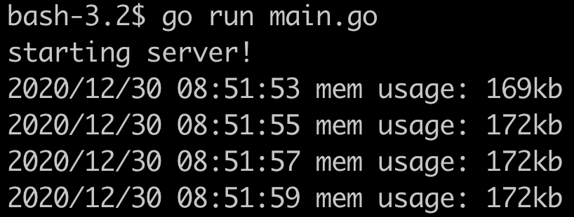
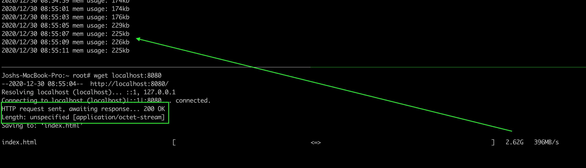
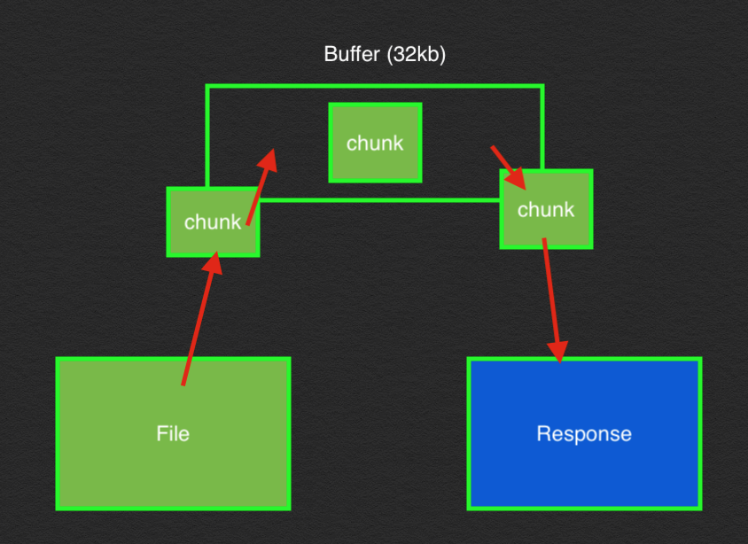

# serving large files :) !

This talks about how we can reason with serving large files to clients.

## running the app

1. Ensure Go is installed!

    ```
    brew install go
    ```

1. Clone the repository
1. Enter the directory
1. Create a large file named `lotsofdata.csv`

    ```
    head -c 10000000000 /dev/urandom > lotsofdata.csv
    ```

1. Run the app!

    ```
    go run main.go
    ```

1. Read the comments in the `main.go` file!

## learning about the memory

1. With the app running, observe the memory usage.

    

1. Make a request to the webserver.

    ```
    wget localhost:8080
    ```

1. Monitor the memory usage alongside the request.

    

    > Note the length in the response is unspecified! It's an octet-stream coming from the server :) !

1. Once the request has finished downloading the file, verify the memory returns to the original usage!

## Additional Considerations

### What makes this work!?

There's a few key problems we need to solve for in order to make models like this work. By understanding these concepts, we can make this work in any language!

1. **Reading the file in chunks.**

    It's critical we don't open the entire CSV file. It's like 8GB! Instead, we need to read a chunk of the file, write it to the response, "flush", and repeat.

    If you look in the code, the magic is mostly in `io.Copy`. By default it is doing everything in 32kb chunks (but we can customize this!). Looking at the code, we have two key variables `f` and `w`.

    `f` is the opened file. It IS NOT READ! but opened for us to read. `f` implements what we'd call a "reader", meaning it can be read :).

    `w` is the response we'll send to the client. It implements a "writer", which means it can be written to.

    ```
    f, err := os.Open(fileName)

	io.Copy(w, f)
    ```

    By doing this we introduce the following.

    1. Grab the buffer.
    1. Read contents of the file until the buffer is filled or end of file (EOF)
    1. Deplete the buffer by writing the data into the response
    1. Repeat!!!

    

1. **Responding with a stream or chunk of data.**

    This can depend on the HTTP version your client is using. Most clients / browsers today will be using HTTP2, but we need to be certain that we can pass data bank in chunks or some form of stream to the client. See the screenshot about that tells WGET it's NOT getting a length specified and it should expect an octet stream!

### Parallelism

Currently, we see usage per request in the realm of 40kb. So if we had a VERY conservative estimate of capping at 20mb, that should serve us in the realm of 500 parallel requests for this big file.

There's a ton of cool things we could do to providing waiting mechanisms or handle back pressure. We also could scale this thing horizontally using a ...... !! loadbalancer !!.